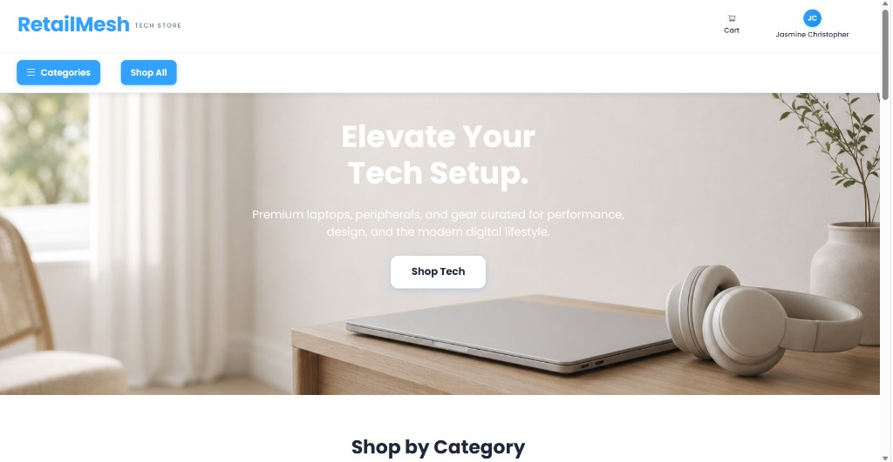
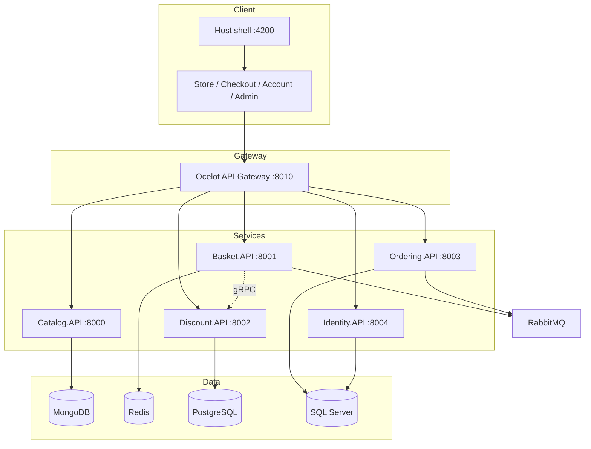
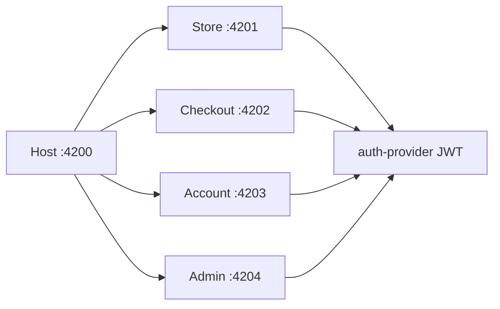
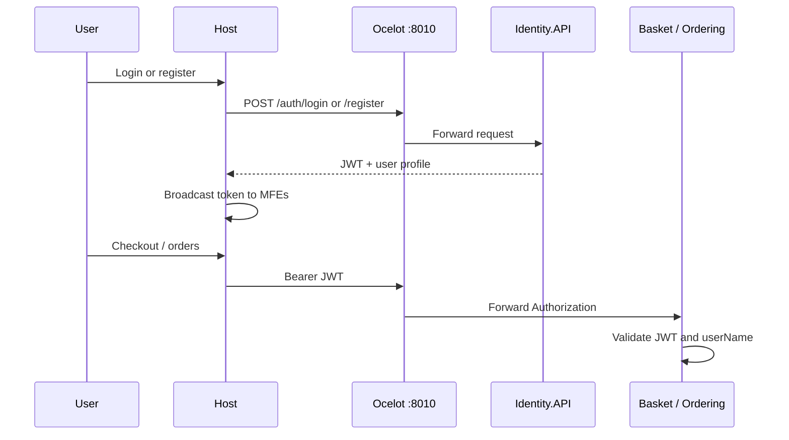

# RetailMesh — Cloud-Native E-Commerce Platform

[](https://dotnet.microsoft.com/)
[](https://learn.microsoft.com/dotnet/csharp/)
[](https://www.typescriptlang.org/)
[](https://react.dev/)
[](https://nx.dev/)
[](https://www.docker.com/)
[](LICENSE)

**RetailMesh** is a full-stack tech storefront: React micro-frontends, .NET microservices, Ocelot API gateway, JWT authentication via **Identity.API**, and event-driven checkout (RabbitMQ).



## About the project

Shoppers browse products without signing in. Checkout, account, and admin areas require login. **Identity.API** issues JWTs; **Basket** and **Ordering** validate the token and ensure the authenticated email matches the `userName` on each request. **Catalog** product reads stay public; admin writes require auth.

Built by **Jasmine Christopher**.

## Architecture

### System overview



### Micro-frontends



### Authentication flow



## Quick start

| Step | Action |
|------|--------|
| 1 | Clone the repo and copy environment file |
| 2 | Start backend with Docker Compose |
| 3 | Start the Nx host and micro-frontends |
| 4 | Sign in or register at `/login` or `/register` |

```bash
git clone https://github.com/jasmine6789/RetailMesh-Cloud-Native-E-commerce-Website.git
cd RetailMesh-Cloud-Native-E-commerce-Website
cp .env.example .env

docker compose up -d --build

cd micro-frontends
npm run setup
npm start
```

Open [http://localhost:4200](http://localhost:4200). Full Docker steps: [LOCAL-DOCKER.md](LOCAL-DOCKER.md).

### Optional: Kubernetes (Minikube)

For a Helm-based cluster with the same Docker images:

```bash
bash scripts/deploy/deploy.sh
```

This deploys infrastructure, **Identity.API**, LocalStack, and APIs; uploads product images to LocalStack; runs Catalog image migration; and port-forwards the gateway (`8010`) and LocalStack (`4566`). Start the storefront separately:

```bash
cd micro-frontends && npm run setup && npm start
```

Full checklist: [kubernetes/LOCAL-K8S.md](kubernetes/LOCAL-K8S.md).

## Local URLs

| Service | URL |
|---------|-----|
| Storefront (host) | http://localhost:4200 |
| API gateway | http://localhost:8010 |
| Identity.API (direct) | http://localhost:8004 |
| Grafana | http://localhost:3000 |
| Prometheus | http://localhost:9090 |

| API | Port |
|-----|------|
| Catalog | 8000 |
| Basket | 8001 |
| Discount | 8002 |
| Ordering | 8003 |
| Identity | 8004 |

## Authentication (Identity.API)

| Endpoint (via gateway) | Method | Purpose |
|------------------------|--------|---------|
| `/auth/login` | POST | Sign in → JWT |
| `/auth/register` | POST | Create account → JWT |
| `/auth/me` | GET | Profile (Bearer token) |

| Account | Password | Role |
|---------|----------|------|
| `demo@retailmesh.com` | `Demo@12345` | customer (seeded) |
| `admin@retailmesh.com` | `Admin@12345` | admin (seeded) |

Configure JWT and database settings in `.env` (`JWT_*`, `IDENTITY_CONNECTION_STRING`). See [.env.example](.env.example).

## Tech stack

| Layer | Technologies |
|-------|----------------|
| Frontend | TypeScript, React 18, Nx, Module Federation, Ant Design, TanStack Query |
| Auth | Identity.API, ASP.NET Core Identity, JWT Bearer |
| Backend | C#, .NET 10, Clean Architecture, CQRS, MassTransit, gRPC, Ocelot |
| Data | MongoDB, Redis, PostgreSQL, SQL Server |
| Ops | Docker Compose, Prometheus, Grafana, Elasticsearch, Jaeger, RabbitMQ |

## More documentation

- [LOCAL-DOCKER.md](LOCAL-DOCKER.md) — primary local workflow (Docker Compose + micro-frontends)
- [kubernetes/LOCAL-K8S.md](kubernetes/LOCAL-K8S.md) — optional Minikube + Helm checklist
- [diagrams/](diagrams/README.md) — 8 core Eraser.io diagrams
- [scripts/README.md](scripts/README.md) — deploy, LocalStack, and K8s helpers
- [SECURITY.md](SECURITY.md) — reporting vulnerabilities

## License

MIT © 2025 Jasmine Christopher. See [LICENSE](LICENSE).
